# 檔案管理器|dde-file-manager|

## 概述

檔案管理器是一款功能強大、簡單易用的文件管理工具。它沿用了傳統檔案管理器的經典功能和布局，並在此基礎上簡化了使用者操作，增加了很多特色功能。一目了然的導航欄、智慧識別的搜尋框、多樣化的檢視及排序讓您管理起來得心應手，經典和超越，只為給您更好的體驗！

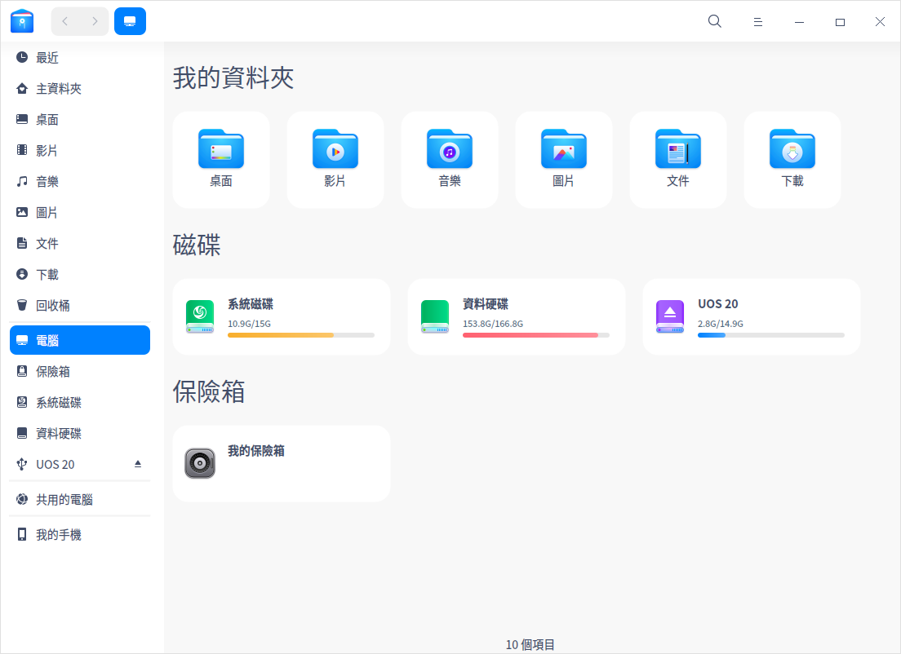

## 使用入門

透過以下方式執行或關閉檔案管理器，或者建立檔案管理器的捷徑。

### 執行檔案管理器

1. 單擊桌面底部的 ，進入啟動器介面。
2. 上下滾動滑鼠滾輪瀏覽或透過搜尋找到檔案管理器，單擊執行。
3. 右鍵單擊 ，您可以：
 - 單擊 **建立桌面捷徑**，在桌面建立捷徑。
 - 單擊 **釘選到Dock**，將應用程式固定到Dock。
 - 單擊 **開機啟動**，將應用程式添加到開機啟動項，在電腦開機時自動執行該應用。

> 竅門：您可以使用組合鍵 **Super + E** 啟動檔案管理器。

### 關閉檔案管理器

- 在檔案管理器介面，單擊  ，關閉檔案管理器。
- 在任務欄右鍵單擊 ，選擇 **全部關閉** 來關閉檔案管理器。
- 在檔案管理器介面，單擊 ，選擇 **離開** 來關閉檔案管理器。

### 查看快捷鍵

在檔案管理器介面上，按下**Ctrl + Shift + /**  組合鍵來查看快捷鍵，熟練的使用快捷鍵，將大大提升您的操作效率。

## 主介面

檔案管理器的主介面簡單易用、功能全面，熟練地使用介面功能將使文件管理更加簡單高效。

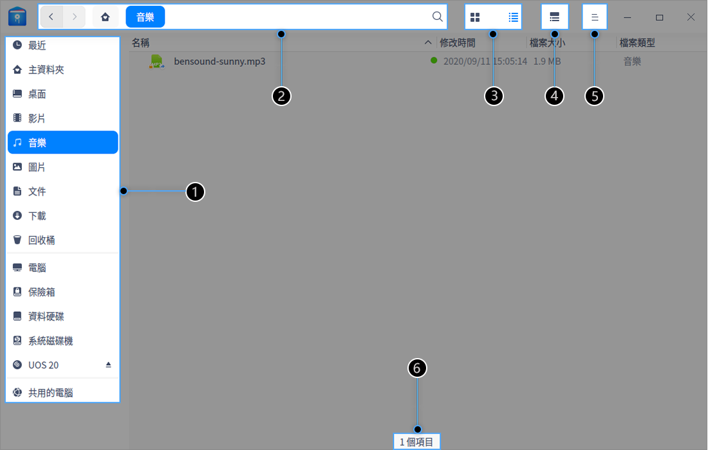

| 標號 | 名稱          | 描述                                                         |
| ---- | ------------- | ------------------------------------------------------------ |
| 1    | 導航欄        | 單擊導航圖示，快速存取本機文件、磁碟、網路鄰居、書籤、標記等。 |
| 2    | 地址欄        | 透過地址欄，您可以快速切換訪問歷史、在上下級目錄間切換、搜尋、輸入地址訪問。 |
| 3    | 圖示/列表檢視 | 單擊  , 圖示，以圖示或列表形式查看文件（夾）。 |
| 4    | 訊息欄        | 單擊 ， 查看文件（夾）的基本訊息和標記。 |
| 5    | 選單欄        | 透過主選單，您可以建立視窗、切換視窗主題、設定共享密碼、設定檔案管理器、查看說明文件和關於訊息、關閉檔案管理器。 |
| 6    | 狀態欄        | 顯示文件數量或者已選中文件的數量。                           |

>  竅門：可拖動左側導航欄右邊的分隔線來改變其寬度。

## 基本功能

檔案管理器具備基本的文件管理功能，對文件(夾)進行新增、複製、重新命名、刪除等操作都非常簡單。

### 新增文件

#### 新增文件

1. 在檔案管理器介面上，單擊滑鼠右鍵。
2. 單擊 **新增文件**。
3. 選擇新增文件的類型。
4. 輸入新增文件的名稱。

#### 新增資料夾

1. 在檔案管理器介面上，單擊滑鼠右鍵。
2. 單擊 **新增資料夾**。
3. 輸入資料夾的名稱。

### 重新命名文件

1. 在檔案管理器介面上，右鍵單擊文件。
2. 選擇 **重新命名**。
3. 輸入檔案名稱，按 **Enter** 鍵或者滑鼠單擊介面空白區域。

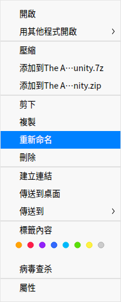

>  竅門：在 **設定** 中勾選「重新命名時隱藏檔案副檔名」，能更方便地修改檔案名稱。

### 批次重新命名

1. 在檔案管理器介面上，選中多個文件。
2. 右擊文件，並選擇 **重新命名**。
   - **取代文件**尋找需要取代的文字，並輸入取代後的文字，檔案名中的關鍵字將被統一取代。
   - **加入文件** 輸入需要加入的文字，並選擇目錄是檔名之前還是之後，檔案名將統一加入被添加的文字。
   - **自訂文件** 輸入檔案名，並輸入序列的遞進數字，檔案名將統一改成新檔案名+遞進數字。
4. 單擊 **重新命名** 來完成操作。

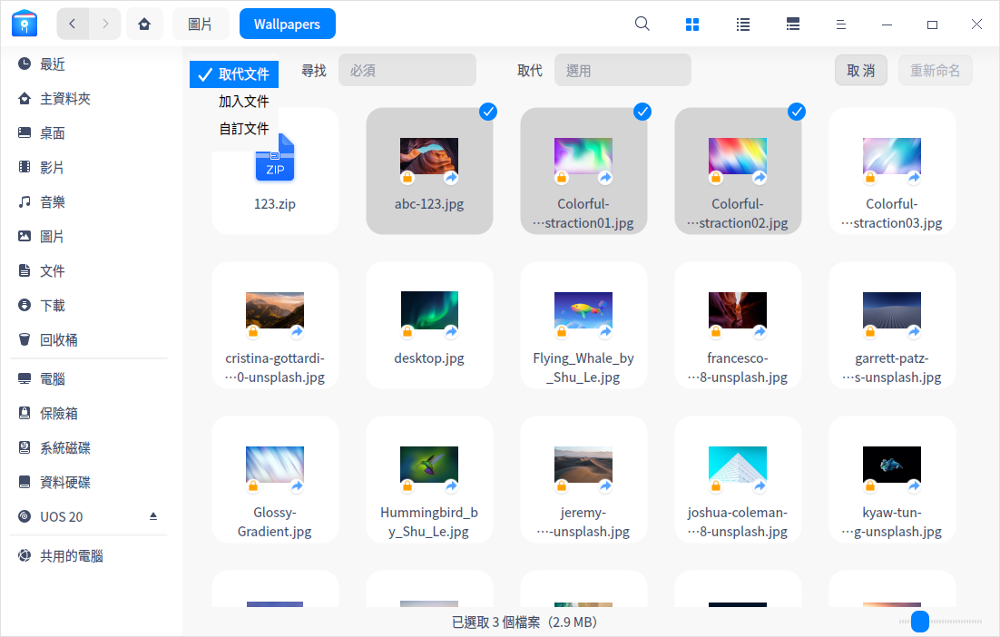

### 查看文件

單擊介面上的  、 圖示來切換圖示檢視和列表檢視。

- 圖示檢視：平鋪顯示文件的名稱、圖示或縮圖。

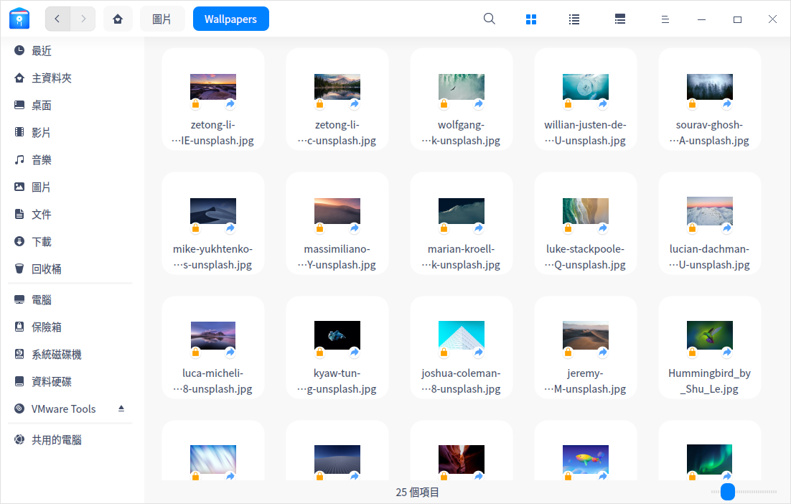

- 列表檢視：列表顯示文件圖示或縮圖、名稱、修改時間、大小、類型等訊息。

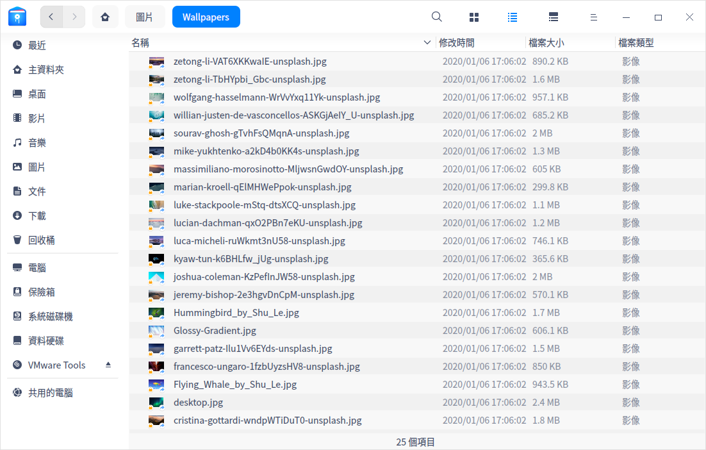

>  竅門：使用  **Ctrl + 1**  和  **Ctrl + 2**   快捷鍵，切換圖示檢視和列表檢視。

### 排序文件

1. 在檔案管理器介面上，單擊滑鼠右鍵。
2. 選擇 **排序順序**。
3. 在子選單中選擇以檔案名稱、修改時間、大小或類型來排序文件。

>  竅門：在列表檢視中，單擊表頭欄的列標籤來切換升序、降序。

### 開啟文件

1. 在檔案管理器介面上，右鍵單擊文件。
2. 選擇 **用其他程式開啟** > **選擇預設開啟程式**。
3. 在程式列表中選擇應用程式。

>  說明：直接雙擊文件會使用預設程式打開。您可以選擇相同類型的多個文件，右鍵選擇「用其他程式開啟」選項，一次開啟多個文件。

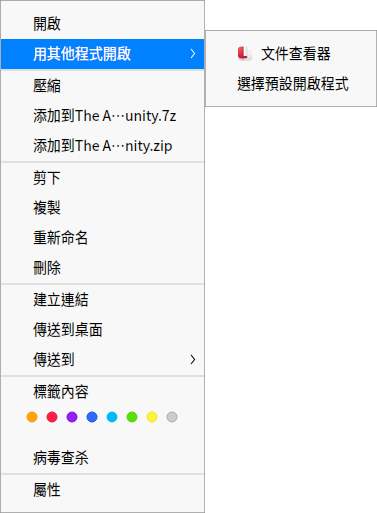

### 隱藏文件

1. 在檔案管理器介面上，右鍵單擊文件。
2. 選擇 **屬性**，勾選 **隱藏此文件**。

### 複製文件

1. 在檔案管理器介面上，右鍵單擊文件。
2. 單擊 **複製**。
3. 選擇一個目標儲存位置。
4. 單擊滑鼠右鍵，然後選擇 **貼上**。

### 壓縮文件

1. 在檔案管理器介面上，右鍵單擊文件。
2. 單擊 **壓縮**。
3. 輸入壓縮包名稱，選擇壓縮包類型和目標儲存位置。
4. 單擊 **壓縮**。

>  說明：開啟「進階選項」 開關設定解壓密碼和分卷大小。加密文件和分卷壓縮僅支援部分壓縮格式。

### 刪除文件

1. 在檔案管理器介面上，右鍵單擊文件。
2. 選擇 **刪除** 。
   - 被刪除的文件可以在回收桶中找到，右鍵單擊回收站中的文件可以進行 **還原** 或 **刪除** 操作。
   - 被刪除的文件的捷徑將會失效。

>  注意：外接裝置刪除文件會將文件徹底刪除，無法從回收桶找回。

### 復原操作

在檔案管理器中，可以用 **Ctrl + Z** 來復原上一步操作，包括：

- 刪除建立的文件。
- 復原重新命名（包括重新命名文件後綴）之前的名字。
- 從回收站還原剛刪除的文件。
- 復原文件到移動（剪下移動、滑鼠移動）前的原始路徑。
- 刪除複製貼上的文件。

> 注意：復原動作最多只能返回兩步；如果操作中有覆蓋某個同名文件和徹底刪除文件，則復原只能返回到這一步。

### 文件屬性

文件屬性會顯示文件的基本資訊，開啟方式和權限設定。資料夾内容會顯示資料夾的基本資訊，共用訊息和權限設定。

1. 在檔案管理器介面上，右鍵單擊文件。
2. 選擇 **屬性**，查看文件屬性。

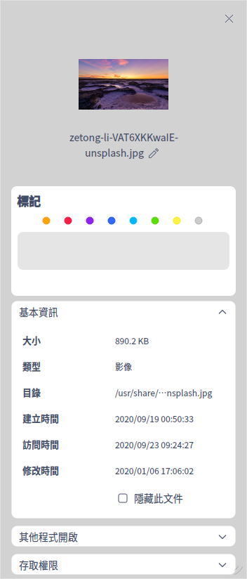

>  說明：查看多個文件屬性會顯示文件總大小和數量；查看捷徑的屬性將會額外顯示來源文件地址。您還可以使用 **Ctrl + I** 組合鍵查看文件屬性。

### 病毒查殺

1. 在檔案管理器界面上，右鍵單擊文件（夾）。
2. 選擇 **病毒查殺**，彈出安全中心病毒查殺界面，您可以對該文件（夾）進行安全掃描，具體操作請參閱安全中心的 [病毒查殺](dman:///deepin-defender#病毒查殺)。

   >  說明：
   > - 如果當前安全中心有查殺任務，則在彈出的對話框中單擊 **查看** 進入安全中心病毒查殺界面進行查看。
   > - 安全中心默認開啟 **加入「病毒查殺」到文件右鍵選單** 的功能，您也可以進入安全中心設置界面，取消勾選該功能。取消勾選後檔案管理器右鍵菜單中不會顯示病毒查殺的選項。

## 常用操作

檔案管理器具備很多特色功能，這些功能都讓文件管理更加簡單、高效。

### 切換地址欄

地址欄由歷史導航、麵包屑和輸入框共同組成。通常情況下地址欄顯示麵包屑。

- 單擊歷史導航按鈕，您可以快速在歷史瀏覽記錄間切換，查看前一個地址或者後一個地址。
- 文件所在位置的每一個層級都會形成一個麵包屑，透過來回單擊麵包屑可以快速在不同文件層級間切換。

當您單擊搜尋圖示，或者在文件路徑上右鍵選擇"編輯位址"，地址欄會切換為輸入框狀態。在輸入框外單擊時，位址欄會自動復原到麵包屑狀態。

- 輸入框帶有智慧識別功能，您可以輸入關鍵字或者訪問地址Enter，系統會自動識別並進行搜尋或訪問。

### 搜尋文件

在檔案管理器中單擊搜尋按鈕，或使用  **Ctrl + F** 快捷鍵進入搜尋狀態，或在地址欄中輸入關鍵字後按 **Enter** 鍵，搜尋相關文件。
  - 需要指定目錄搜尋時，請先進入該目錄，然後再進行搜尋。

>  說明：
> 在檔案管理器的 **設定**中，預設勾選了“自動索引內部硬碟”，您可以選擇勾選“外部裝置連上電腦時索引”，加快在外部裝置的搜尋速度。

#### 全文搜尋

您可以透過文件內容關鍵字來搜尋文件。

1. 在檔案管理器中，單擊  > **設定**。
2. 在進階設定項勾選“全文搜尋”來開啟此功能。
3. 使用組合鍵  **Ctrl + F** 或在地址欄中單擊搜尋按鈕進入搜尋狀態，輸入關鍵字後按下鍵盤上的 **Enter** 鍵，搜尋相關文件。

#### 進階搜尋

當文件較多，搜尋較慢時，啟用進階搜尋縮小搜尋範圍，提高搜尋效率。

1. 在搜尋狀態下，輸入關鍵字後按 **Enter** 鍵，當搜尋到結果時，搜尋框右側顯示  圖示，單擊該圖示可進行進階搜尋的操作。

2. 選擇搜尋範圍、檔案大小、文件類型、修改時間、訪問時間和建立時間，進行更精準的搜尋。

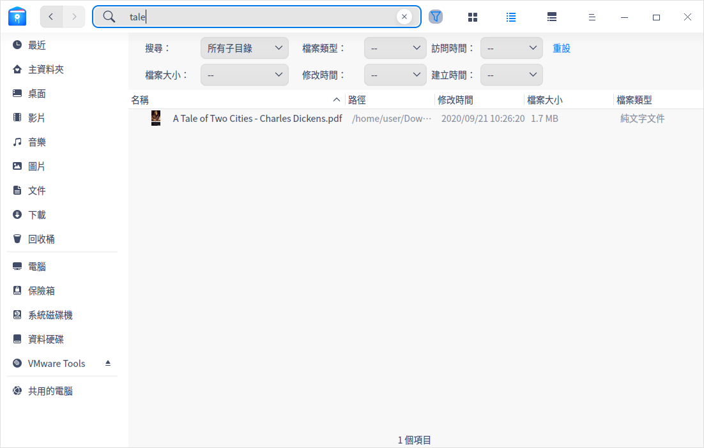

### 最近使用

在左方面板上預設有 **最近** 入口，單擊可以查看最近使用的檔案項目。文件預設按照訪問時間倒序排列。

>  說明：若想隱藏「最近」，可在設定 > 基本設定 > 隱藏文件，取消勾選「在左方面板顯示最近檔案項目」。若要隱藏某一個文件的訪問記錄，右擊該文件選擇 **移除**，該操作不會刪除文件。

### 多分頁

檔案管理器支援多分頁顯示。

1. 在檔案管理器介面上，右鍵單擊資料夾。
2. 選擇 **在新分頁中開啟**。
3. 當視窗有多個分頁時，可以：
 - 單擊標籤欄右側的 + 繼續添加分頁。
 - 單擊標籤上的 × 關閉分頁或將滑鼠置於分頁欄上，單擊滑鼠中鍵關閉分頁。

   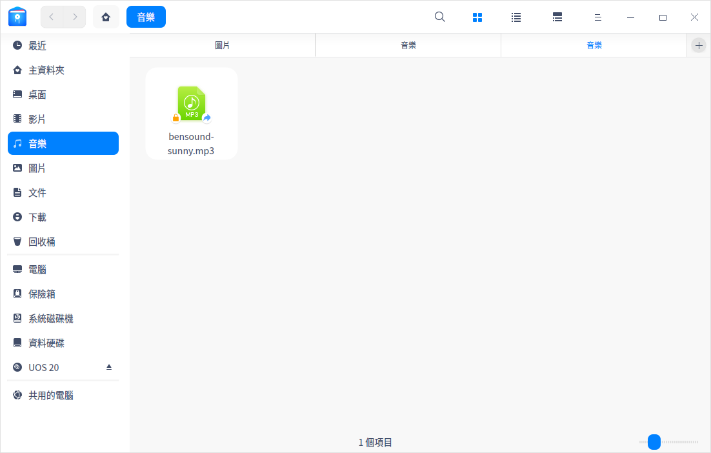

>  竅門：檔案管理器視窗只有一個分頁時，分頁欄是隱藏的，您還可以使用快捷鍵  **Ctrl** + **T** 來建立分頁。

### 書籤管理

為常用資料夾添加書籤，以便從左側導航欄快速訪問。

- 添加書籤：右鍵單擊資料夾，選擇 **加到書籤** 就可以在導航欄建立書籤。
- 移動書籤：在導航欄上下拖動書籤調整書籤排序。
- 刪除書籤：右鍵單擊書籤，選擇 **移除** 來刪除書籤；或右鍵單擊已添加書籤的資料夾，選擇 **移除書籤** 來刪除書籤。

### 標記内容

透過給資料（夾）添加標記，可以更好地分類管理您的文件。

>  說明：目前僅x86平台支援 **標記内容** 功能。

#### 添加標記

您可以一次為多個檔案（資料夾）添加標記，一個檔案（資料夾）也可以添加多個標記；您還可以在檔案（資料夾）的屬性中添加標記。添加成功的標記會出現在左側導航欄內。

##### 透過編輯框添加標記

1. 右鍵單擊檔案（資料夾），選擇 **標記内容**。
2. 輸入標記名稱。若要添加多個標記，用逗號分隔。
3. 編輯完成後單擊空白處儲存設定。

> 說明：標記顏色從8種預設顏色中隨機分配。

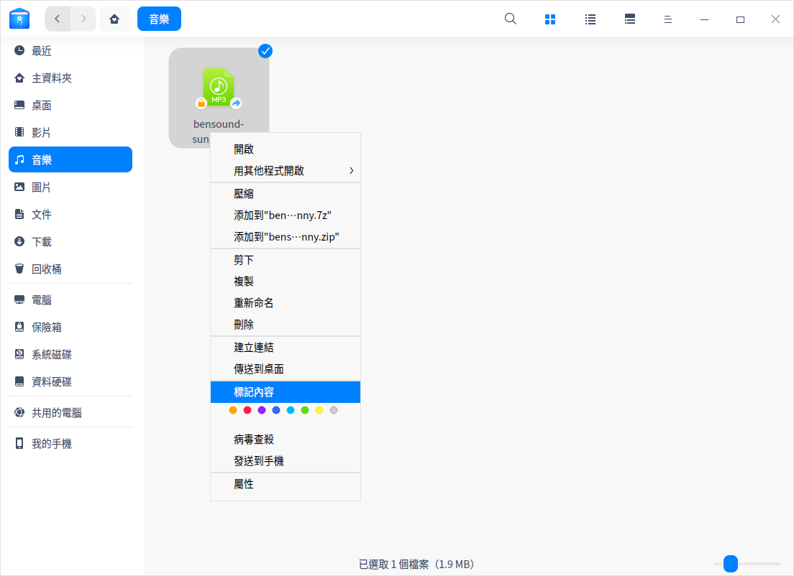

##### 透過顏色按鈕添加標記

右鍵單擊檔案（資料夾），選擇「顏色按鈕」，直接生成這個顏色的標記。

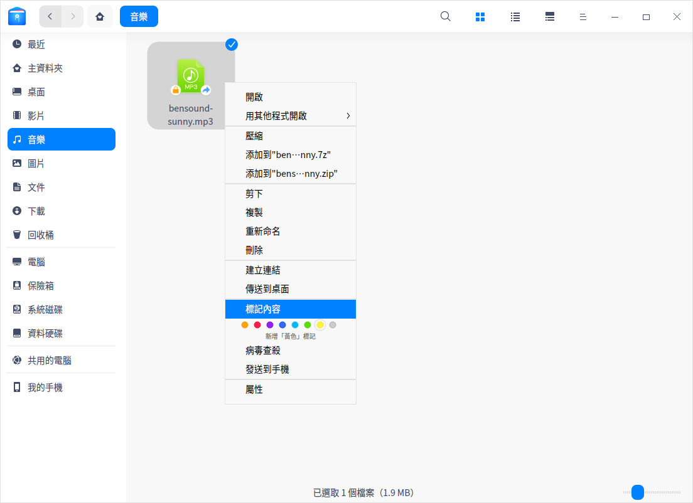

##### 透過右側訊息欄添加標記
選擇檔案（資料夾）後，單擊 ，在右側訊息欄中也可以添加標記。

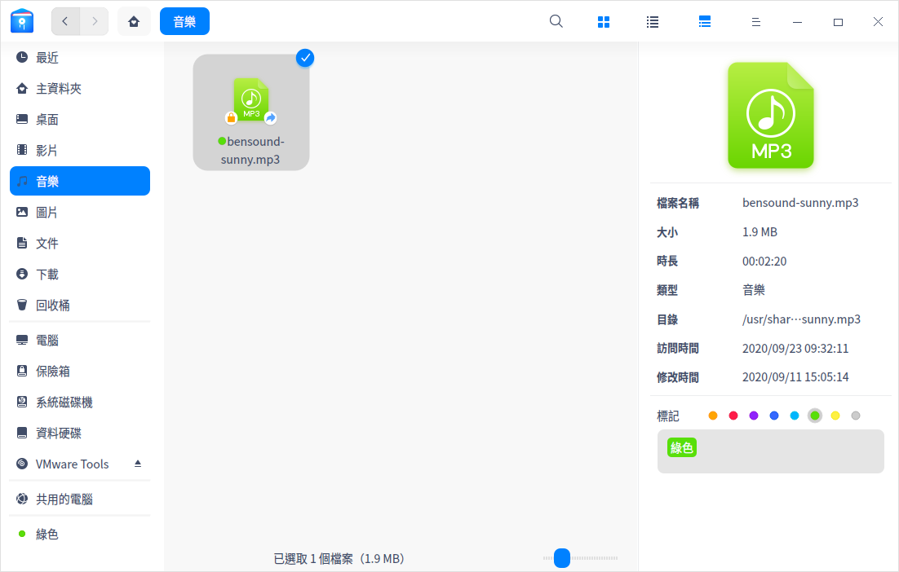

> 說明：複製或剪下有標記的文件，所產生的文件仍然具有同樣的標記。

#### 重新命名標記

在側邊導航欄中，右鍵單擊某個標記，選擇 **重新命名**，修改目前標記的名稱。

#### 修改標記顏色

在左側導航欄中，右鍵單擊某個標記，選擇「顏色按鈕」，即可修改目前標記的顏色。

#### 排序標記

上下拖動標記即可調整標記排序。

#### 刪除標記

右鍵單擊某個標記，選擇 **移除**，刪除目前標記。

### 文件預覽

檔案管理器支援空白鍵預覽功能，選中文件並按下鍵盤上的空白鍵就可以快速預覽文件。預覽視窗可以查看圖片解析度、檔案大小、文字內容等，還支援gif、音訊、影片播放。

#### 預覽影片

1. 選擇您要預覽的影片檔案，按下空白鍵，即可開始預覽。
2. 單擊影片任意地方可暫停播放。
3. 播放過程中，可以拖動進度條來快進快退。
4. 單擊底部 **開啟** 按扭，在預設程式中開啟該影片檔案。

>  說明：您也可以同時選擇多個文件，按下空白鍵進行預覽。

### 權限管理
選擇對應文件/資料夾，單擊右鍵，選擇屬性，單擊 **存取權限**， 為擁有者，群組，和其他使用者設定檔案權限。

### 共用資料夾

當您設定了共用資料夾時，「我的共用」將會出現在導航欄上。當所有共用資料夾都取消共用後，「我的共用」自動從導航欄中移除。

#### 共用本機文件

1. 在檔案管理器介面上，右鍵單擊資料夾。
2. 選擇 **共用資料夾**。
3. 在資料夾的屬性視窗，勾選 **共用資料夾**。
4. 根據需要設定 **共用名稱**、**存取權限**、**匿名** 後關閉視窗。
5. 在檔案管理器介面上，單擊  > **設定共用密碼**。
6. 輸入共用密碼後單擊 **確定**。

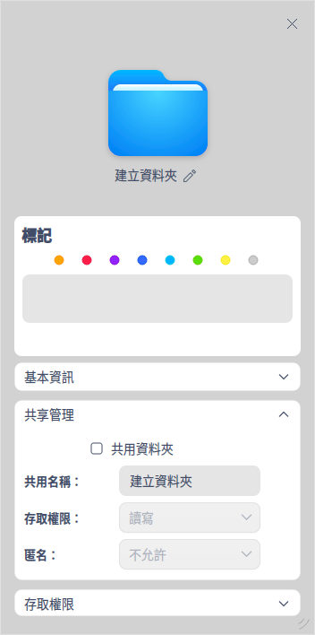

>  竅門：取消勾選 **共用資料夾** 可以取消文件共用，也可以右鍵單擊文件，選擇 **取消共用**。

#### 訪問共用文件

區域網路中其他使用者共用的文件都可以在網路鄰居中找到，您也可以透過smb訪問共用文件。

1. 單擊  > **連線到伺服器**，在編輯框中輸入伺服器地址，如：smb://xx.x.xx.xxx（一般為IP位址），單擊 **連接**；或者直接在地址欄中輸入伺服器地址，按下鍵盤上的 **Enter** 鍵。
2. 輸入使用者名稱和共用密碼。
   - 未加密的共用文件可以匿名訪問，不需要輸入使用者名稱和密碼。
   - 加密的共用文件會彈出登入框，輸入使用者名稱和密碼之後才能訪問。
      - 使用者名稱：共用者登入系統的使用者名稱。
      - 密碼：共用文件時設置的共用密碼。
3. 單擊 **連線**。

### 以管理員身份開新視窗

前提條件：「控制中心」>「一般設定」中開發者模式已打開。

1. 在檔案管理器介面空白處單擊滑鼠右鍵。
2. 選擇 **以管理員身份開新視窗**，在彈出的對話框中輸入使用者密碼，單擊 **確定**。
3. 該資料夾會以新視窗打開，在此視窗中可以進行進階權限的操作，關閉視窗後，終止管理員權限。

### 從終端中開啟

1. 在檔案管理器介面空白處單擊滑鼠右鍵。
2. 選擇 **開啟終端機**，會啟動終端應用程式，終端的路徑為目前目錄。

### 燒錄光碟
您可以透過燒錄功能將音樂、影片、圖片或鏡像檔案複製光碟中。其中，ISO9660檔案系統支援所有的CD和DVD光碟格式，UDF檔案系統僅支援部分光碟格式。

<table class="block1">
<tr>
<td>類型</td>
<td>光碟格式</td>
<td>ISO9660</td>
<td>UDF</td></tr>
<tr>
<td rowspan="2">空盤</td>
<td>DVD-R、DVD+R</td>
<td>支援</td>
<td>支援</td></tr>
<tr>
<td>非DVD-R、DVD+R</td>
<td>支援</td>
<td>不支援</td></tr>
<tr>
<td rowspan="2">非空盤</td>
<td>DVD-R、DVD+R</td>
<td>支援追加檔案</td>
<td>僅支援Windows原生工具燒錄的格式</td></tr>
<tr>
<td>非DVD-R、DVD+R</td>
<td>支援追加檔案</td>
<td>不支援追加檔案</td></tr>   
</table>

1. 將光碟插入到燒錄機中。
2. 打開檔案管理器，單擊導航欄中的光碟圖示，進入燒錄CD的介面。

3. 右鍵單擊 文件（夾），選擇 **添加至光碟燒錄** 或直接將文件（夾）拖曳到燒錄CD的介面。
4. 在燒錄CD介面，單擊右上角按鈕 **燒錄**。

   > 說明：如果要從燒錄列表中刪除某個文件（夾），右鍵單擊該文件（夾），選擇 **刪除**，將該文件（夾）從列表中移除。

5. 彈出對話框，輸入光碟名稱。您也可以進入 **進階設定** 介面，設定檔案系統、寫入速度，或勾選「允許追加資料」、「核驗資料」等，單擊 **燒錄**。

6. 燒錄完成後介面彈出提示框，單擊 **確定**。

> 說明：如果需要擦除光碟資料，可以右鍵單擊導航欄中光碟圖示，選擇 **卸载**，再次右鍵單擊該光碟圖示並選擇 **清除**。

### 建立捷徑

1. 在檔案管理器介面上，右鍵單擊文件或資料夾。
2. 選擇 **建立連結**。
3. 在跳出視窗中選擇建立位置、連結名稱。
4. 單擊 **儲存**，在目標位置會生成該文件(夾)的捷徑。

>  竅門：選擇 **傳送到桌面** 可以直接在桌面上生成該文件(夾)的捷徑。

### 傳送文件到外接磁碟

當有外接磁碟接入時，您可以將文件或資料夾發送到外接磁碟。

1. 在檔案管理器介面上，右鍵單擊文件或資料夾。
2. 選擇 **傳送到** > 外接磁碟。
3. 文件或資料夾將會被傳送到移動外接磁碟。

### 傳送文件到藍牙
若您的電腦配備了藍牙模組，便可透過藍牙進行短距離文件傳輸的操作。

前提條件：傳送端與接收端藍牙設備已配對並成功連接。具體連接方法可參考 [連接藍牙設備](dman:///dde#連接藍牙設備)。

1. 在檔案管理器界面，右鍵單擊需要傳送的文件或文件壓縮包。
2. 選擇 **傳送到** > **傳送到藍牙**。
3. 在彈出的藍牙文件傳輸對話框中勾選接收設備，單擊 **下一步**。
4. 此時接收端會收到文件接收的請求，待接收端同意請求後，傳送端開始傳輸文件。

## 文件角標

您可以透過命令列，將圖示文件指定給一個文件或資料夾作為角標顯示出來。
   > 說明：
   >- 角標文件支援svg、jpg、png、bmp、gif格式，且大小不超過100KB。
   >- 隨身碟及光碟下的文件，不支援添加角標。

### 添加單個角標

1. 在終端輸入指令 **gio set xxx(文件路徑)  -t stringv metadata::emblems "xxx(圖示路徑)"** ，該指令預設在文件（夾）右下角添加角標。

   > 注意：系統已定義的特殊角標，不支援被取代。

2. 您也可以在上述指令中加入位置參數，將角標添加在文件（夾）的左上角（lu）、左下角（ld）、右上角（ru）或右下角（rd）。

例如：在文件（夾）左上角添加角標

**gio set xxx(文件路徑)  -t stringv metadata::emblems "xxx(圖示路徑);lu"**

### 添加多個角標

在命令列中加入“**|**”符號將角標文件路徑連結起來，為文件（夾）添加2~4個角標。文件（夾）同一個位置不支援疊加角標，僅支援取代。

例如：在文件（夾）四個角都添加角標

**gio set xxx(文件路徑)  -t stringv metadata::emblems "xxx(圖示路徑);lu|xxx(圖示路徑);ld|xxx(圖示路徑);ru|xxx(圖示路徑);rd"**

### 復原角標

在終端中輸入指令 **gio set xxx(文件路徑) -t stringv metadata::emblems ""** 復原文件（夾）上所有的角標。

## 文件保險箱

文件保險箱旨在為您打造專屬的安全空間，為您的隱私保駕護航。先進的加密技術，便捷的操作流程，使用起來得心應手。

### 設定保險箱密碼

首次使用保險箱需要對其進行密碼設定，具體步驟如下：

1. 滑鼠左鍵單擊檔案管理器導航欄中  圖示，或者在電腦介面雙擊 「我的保險箱」，在彈出的保險箱對話框中單擊 **建立** 按鈕。 
2. 在設定解鎖方式的對話框中設定解鎖類型、保險箱密碼、重複保險箱密碼等，單擊**下一步**。

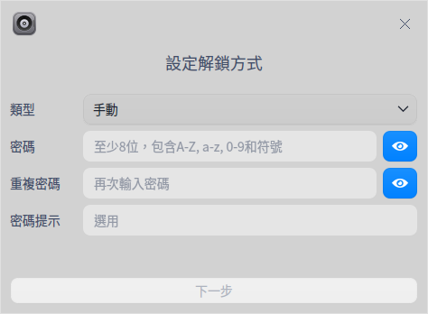

>  說明: 密碼必須同時包含大寫字母、小寫字母、數字和符號，且字元不小於8位，否則無法進入下一步。

3. 此時保險箱密碼生成金鑰/二維碼，建議您將金鑰/二維碼儲存，若忘記密碼，可用金鑰/二維碼開啟保險箱。單擊 **下一步**。
4. 單擊 **加密保險箱**；在彈出的認證對話框中輸入使用者登入密碼，單擊 **確定**。
5. 在彈出的完成加密對話框中單擊 **確定** 。設定完成後可將文件放入保險箱中。

### 鎖上保險箱

將文件放入保險箱後，右鍵單擊導航欄  圖示或者在電腦介面右鍵單擊「我的保險箱」。
- 選擇 **立即上鎖**，立即將文件保險箱鎖上。
- 選擇 **自動上鎖**，在其下拉選單進行設定：
  + 選擇「永不」，電腦在鎖定螢幕或關機前一直保持未上鎖狀態。
  + 選擇「5分鐘」、「10分鐘」或者「20分鐘」後自動上鎖保險箱。

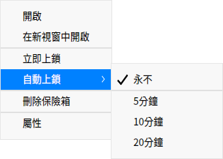

### 解鎖保險箱

右鍵單擊導航欄  圖示或者電腦介面 「我的保險箱」。

- 選擇 **解鎖**，在彈出的對話框中輸入保險箱密碼，單擊 **解鎖**。
- 選擇 **金鑰解鎖**，在彈出的對話框中輸入32位金鑰，單擊 **解鎖**。
> 竅門：您也可以單擊導航欄  圖示或者雙擊電腦介面 「我的保險箱」，直接使用密碼解鎖保險箱。

### 刪除保險箱

刪除保險箱需要提前解鎖保險箱。
1. 右鍵單擊導航欄  圖示或者在電腦介面右鍵單擊 「我的保險箱」，選擇 **刪除保險箱**。
2. 在彈出的刪除保險箱對話框中輸入保險箱密碼，單擊 **刪除**。
3. 在彈出的認證對話框中輸入使用者登入密碼，單擊 **確定** 完成刪除操作。
>  注意：刪除保險箱會將裡面的文件一併刪除。在進行刪除操作前，請將保險箱中的文件備份。

## 磁碟管理

檔案管理器可以管理本機和外接磁碟。

### 查看磁碟

您的本機磁碟會顯示在檔案管理器的左側導航欄上。當您掛載外接磁碟或者插入其他移動儲存裝置時，也會在導航欄上看到相應的磁碟圖示。

<table class="block1">
    <caption></caption>
    <tbody>
        <tr>
            <td>本機磁碟</td>
            <td>本機硬碟分區的所有磁碟</td>
        </tr>
        <tr>
            <td>外接磁碟</td>
            <td>包括行動硬碟、隨身碟、光碟</td>
        </tr>
    	<tr>
            <td>移動裝置</td>
            <td>手機記憶體、記憶卡、SD卡等</td>
        </tr>
    </tbody>
</table>

>  說明：如果磁碟或磁碟中的資料夾被加密了，請輸入密碼後查看文件。

### 本機磁碟

#### 隱藏本機磁碟

1. 在檔案管理器介面，單擊  > **設定**。
2. 在進階設定選項中勾選 **隱藏系統硬碟**。

#### 重新命名本機磁碟
1. 在左側導航欄或電腦介面，右鍵單擊需要重新命名的本機磁碟。
2. 選擇 **重新命名**。
3. 輸入新名稱後按下鍵盤上的 **Enter** 鍵或單擊空白處儲存修改。

>  竅門：在電腦介面，慢速雙擊本機磁碟，呈現編輯框後便可進行重新命名操作。

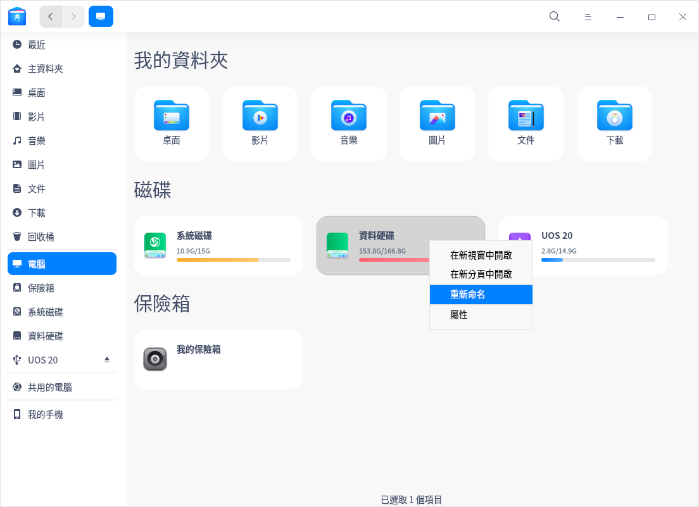

### 外接磁碟

#### 彈出外接磁碟

1. 在左側導航欄或電腦介面，右鍵單擊需要移除的磁碟。
2. 選擇 **安全移除**。
3. 磁碟將從磁碟列表中刪除，一併彈出該磁碟的所有分區。

>  竅門：如果要彈出光碟，請選擇 **彈出** 來移除光碟。單擊導航欄中磁碟右邊的  同樣可以彈出磁碟或光碟。

#### 重新命名外接磁碟
1. 在左側導航欄或電腦介面，右鍵單擊需要重新命名的磁碟。
2. 選擇 **移除**後，再次單擊右鍵選擇 **重新命名**。
3. 輸入新的卷標名稱，按下鍵盤上的 **Enter** 鍵或單擊空白處儲存修改。

#### 格式化外接磁碟

1. 在左側導航欄或電腦介面，右鍵單擊需要格式化的磁碟。
2. 選擇 **卸载**，再次單擊右鍵選擇 **檔案格式**。
3. 在格式化跳出視窗中設定格式化之後的文件類型和卷標。
4. 單擊 **格式化**。

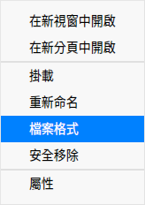

>  說明：快速格式化速度快，但是資料仍然可能透過工具被復原，如果想要格式化後的資料無法被復原，可以取消勾選「快速格式化」，然後執行格式化操作。

## 主選單

在主選單中，您可以新增視窗、切換視窗主題、連線到伺服器、設定共用密碼（見[共用本機文件](#共用本機文件)）、設定檔案管理器、查看說明手冊和版本介紹。

### 新增視窗

1. 在檔案管理器介面，單擊 。
2. 單擊 **新增視窗**。

### 連線到伺服器

透過連接伺服器訪問區域網路共用文件（見[訪問共用文件](#訪問共用文件)）。

1. 在檔案管理器介面，單擊 。
2. 選擇 **連線到伺服器**，在編輯框中輸入伺服器IP位址（XX.XX.XX.XX）。
   - 單擊  按鈕可將該地址添加到“個人收藏伺服器”列表中。
   - 在“個人收藏伺服器”列表中選中一個地址，單擊  按鈕，將該地址從收藏列表中移除。
3. 單擊 **連線**。

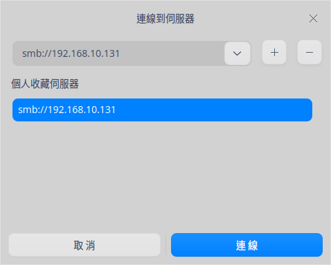

### 設定

#### 基本設定
1. 在檔案管理器介面，單擊 > **設定** 。
2. 選擇 **基本**
   + 勾選 **永遠在新視窗開啟**。
   + 設定雙擊或單擊打開文件。
   + 設定 **視窗預設開啟**、**新建分頁時開啟**哪個目錄。
   + 設定檔案圖示大小 。
   + 設定 **預設顯示** 以圖示顯示或列表展示。
   + 勾選 **顯示隱藏檔案**，檔案管理器中被隱藏的檔案會顯示出來。
   + 勾選 **重新命名時隱藏檔案副檔名**，重新命名時不會顯示副檔名。
   + 勾選 **在左方面板顯示最近檔案項目**，在左側導航欄顯示最近使用的檔案。

#### 進階設定

1. 在檔案管理器介面，單擊 > **設定** 。
2. 選擇 **進階** 選項。
   + 勾選 **自動索引內部硬碟**，搜尋文件時會搜尋內建磁碟中的文件。
   + 勾選 **外部装置連上電腦時索引**，搜尋文件時也會搜尋外接裝置中的文件。
   + 勾選 **全文搜尋**，透過文件中的內容來索引。
   + 勾選預覽文件類型。
   + 勾選 **自動掛載**，接入外接磁碟時自動掛載。
   + 勾選 **自動掛載後開啟**，接入外接磁碟時自動掛載並打開該磁碟。
   + 勾選 **使用檔案管理器的選擇檔案對話框**，選擇文件時打開檔案管理器視窗。
   + 勾選 **開啟普通刪除提示**，刪除文件時彈出提示對話框。
   + 勾選 **隱藏系統硬碟**，導航欄和電腦介面將不顯示本機磁碟。
   + 勾選 **在磁碟圖標上顯示文件系統標籤**。

### 主題

視窗主題包含亮色主題、暗色主題和系統主題。

1. 在檔案管理器介面，單擊 。
2. 單擊 **主題**，選擇一個主題。

### 說明

查看說明手冊，進一步了解和使用檔案管理器。

1. 在檔案管理器介面，單擊 。
2. 單擊 **說明**。
3. 查看檔案管理器的說明手冊。

### 關於

1. 在檔案管理器介面，單擊 。
2. 單擊 **關於**。
3. 查看檔案管理器的版本和介紹。

### 離開

1. 在檔案管理器介面，單擊 。
2. 單擊 **離開**。
