# Deepin File Manager|../common/deepin-file-manager.svg|

## Overview|../common/icon_overview.svg|

Deepin File Manager is developped by Deepin Technology Team. As the core component to manage files in deepin, it is a powerful, easy-to-use file manager with an elegant and simple interface. Full-featured, well-designed, effecient-improved, Deepin File Manager will be a good help in your daily life and work.

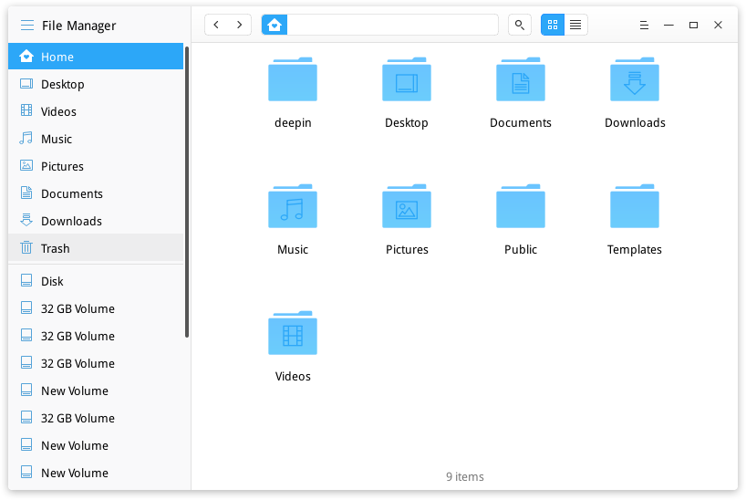

## Guide|../common/icon_guide.svg|

You can run, close and create a shortcut for Deepin File Manager by the following ways.

### Run Deepin File Manager

1. Click on  or move the mouse pointer to the upper left corner of the screen to enter Launcher interface.
2. Locate  by scrolling mouse wheel or searching by "deepin file manager" in Launcher interface.
3. Right click on , you can
 - Click on **Send to desktop** to create a desktop shortcut.
 - Click on **Send to dock** to fix the application on dock.
 - Click on **Add to startup** to add the application to startup, it will automatically run when the system starts up.

> : In Control Center, you can set Deepin File Manger as the default file manager. Specific operations refer to [Default Application Settings](dman:///dde-control-center#Default Application Settings).

### Exit Deepin File Manager

- In Deepin File Manager interface, click on  to exit Deepin File Manager.
- Right click on  on dock, select **Close all** to exit Deepin File Manager.
- Click on  and select **Exit** to exit Deepin File Manager.

## Main Interface|../common/icon_maininterface.svg|

In Deepin File Manager main interface, user can execute many operations with all the functional bars in it. It is designed to be easy-to-use, user-friendly and efficient improving.

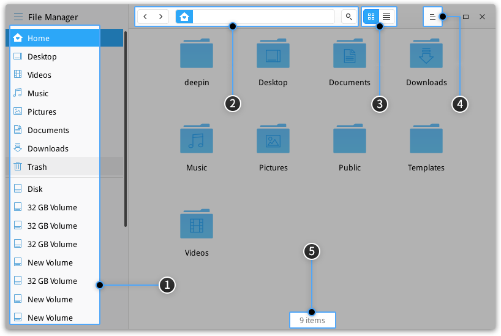

<table class="block1">
    <caption></caption>
    <tbody>
        <tr>
            <td>1</td>
            <td>Navigation bar</td>
            <td>Displays user directory, mounted disks and bookmarks.</td>
        </tr>
        <tr>
            <td>2</td>
            <td>Address bar</td>
            <td>Input keywords to search or input directory to access corresponding contents. Use   to go back or forward. Use breadcrumb bar to switch among parent directories and sub directories.</td>
        </tr>
        <tr>
            <td>3</td>
            <td>View</td>
            <td>User can switch view modes by clicking on  and .</td>
        </tr>
        <tr>
            <td>4</td>
            <td>Settings</td>
            <td>User can create new window, view manual and application information, and exit the application in ** Settings**.</td>
        </tr>
        <tr>
            <td>5</td>
            <td>Status</td>
            <td>Displays number of files or number of selected files, user can drag the slider to adjust the size of icons in the directory.</td>
        </tr>
    </tbody>
</table>

## Basic Functions|../common/icon_basicfuncton.svg|

Deepin File Manager is featured with the basic functions as a file manager, user can easily create, copy, rename or delete files/folders with it.

### New Document/Folder

#### New Folder

1. In Deepin File Manager interface, right click and select ** New folder**.
2. Input a name for the new folder, and press , or click on blank area.

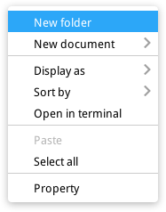

#### New Document

1. In Deepin File Manager interface, right click and select ** New document**.
2. In the popup menu, select the document format you wish to create.
3. Input a name for the new document, and press , or click on blank area.

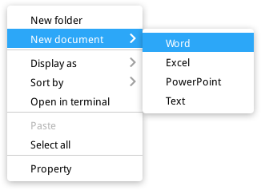

### Rename File/Folder

1. Select the file/folder to be renamed, right click and select ** Rename**.
2. Input a new name for the file/folder, and press , or click on blank area.

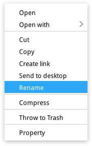

### Copy File/Folder

1. Select the files/folders to be copied, right click and select ** Copy**.
2. Enter the directory to which the files/folders will be pasted, right click and select ** Paste**.

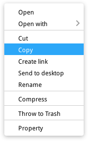 

> ：A window will popup to show the progress as it starts copying. By clicking on  you can cancel the copying process. By hovering the mouse pointer to the round progress bar, it will switch to a pause button, you can pause the copying process by clicking on it.

### Compress File/Folder

1. Select the files/folders to be compressed, right click and select ** Compress**.
2. Input a file name and select a file format for the to be compressed file.
3. Select a location to store the to be compressed file.
4. Select ** Create** to generate the compressed file.

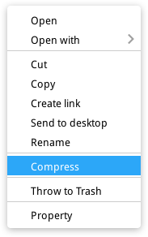

> : In ** Other Options**, user can choose to encrypt the compressed file and the file list, and also to split the to be compressed file into several parts to reduce individual file sizes of the compressed file.

### Delete File/Folder

Select the files/folders to be deleted, right click and select ** Throw to Trash**.
- To permanently delete the files/folders, enter Trash, click on ** Empty** > ** Empty Trash**.
- To restore deleted files/folders, enter Trash, select the files/folders to restore, click on ** Restore**, the files/folders will be moved to their original directory.

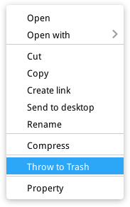

> : Permanently deleted files/folders can not be restored.

> : To permanently and selectively delete some files/folders from Trash, select the targeted files/folders, right click and select ** Delete from Trash**.

### Options to Open a File

User can select to open a file with different applications.
1. In Deepin File Manager, right click on the file to open.
2. In the context menu, select ** Open with**.
3. Select an application to open the file.

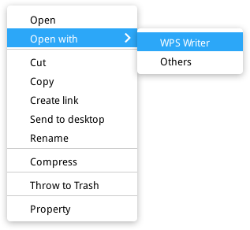

### Display Modes

1. Click on  in Deepin File Manager interface to switch to icon display.
2. Click on  in Deepin File Manager interface to switch to list display.

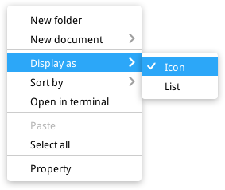

> : User can right click in blank area in Deepin File Manager interface, select ** Display as** in the context menu, then choose between ** Icon** and ** List**.

### Sorting

1. Right click in the blank area in Deepin File Manager, select ** Sort by**.
2. Choose among the sorting options, which include ** Name**, ** Size**, ** Type** and ** Time modified**.

### File/Folder Properties

User can view the information about a file/folder.
1. In Deepin File Manager interface, right click on a file/folder and select ** Property**.
2. In the popup window, user can view the information about the file/folder.

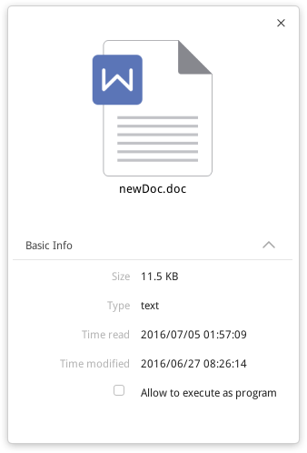

## Common Operations|../common/icon_commoncoperat.svg|

Deepin File Manager is featured with many useful functions, such as breadcrumb bar, bookmarks, file sharing, accessing computers in LAN, opening file/folder in Terminal and so on. They are all designed to ease the commonly used operations.

### Switch Address Bar

There are three sections in address bar, namely the breadcrumb bar, search bar and directory bar.

By default, breadcrumb bar is displayed in the address bar. By clicking on the blank area in the address bar or click on , it will switch to directory/search bar, which can be used to access directory and search for target items.
By inputting a directory/keywords in the directory/search bar and pressing , user can access the target directory/search for target items.

> : When user accesses a sub directory, all the parent directories of the sub directory will become a breadcrumb in the address bar. By clicking on the breadcrumbs, user can easily switch among the sub directories and their parent directories.

### Search Items

User can search for targeted item by the searching function integrated in Deepin File Manager.

1. In the address bar of Deepin File Manager, switch to search.
2. Input keywords in the search bar and press , the search results will popup in the window.

> : To search in a designated directory, enter that directory and search. To search all directories, input  in the search bar and press  to enter root directory, then search for the target item.

### Manage Bookmarks

#### Add Bookmarks

User can add folders to bookmarks in Deepin File Manager.
1. In Deepin File Manager, right click on the folder to add as bookmark.
2. In the popup context menu, select ** Add to bookmark**.

#### Move Bookmarks

User can move bookmarks within the bookmark area. In Deepin File Manager, drag and drop the bookmark to the designated location.

#### Delete Bookmarks

User can remove bookmarks by right clicking on the bookmark and select ** Remove**, or drag and drop the bookmark out of the navigation bar to remove it.

### Computers in LAN

User can visit computers in LAN to access files and folders.
1. In Deepin File Manager interface, click on .
2. Double click on the computer icon to access.
3. Select to connect as ** Anonymity** or ** Registered user**. For ** Registered user**, user needs to input username and password to connect.
4. Click on ** Connect** to establish connection.

### Open in Terminal

User can open folders in terminal to execute operations.
1. In Deepin File Manager, enter the folder.
2. Click on blank area in the folder, and select ** Open in terminal**.

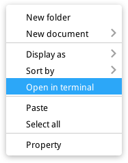

### Create Link

User can create links for items, and put the links in easy-to-reach folders (such as Desktop) to access the items faster.
1. In Deepin File Manager, select the item to create a link for.
2. Right click and select ** Create link**.
3. In the popup window, select a folder to store the link.
4. Click on ** Save** to finish creating the link.

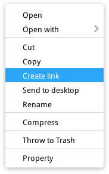

>: By selecting ** Send to desktop** for an item, user can create a link on desktop with one click.

## Disk Management|../common/icon_diskmanagement.svg|

In Deepin File Manager, mounted disks are displayed in disk management area in the navigation bar.

### Display Disks

Mounted disks are displayed in the left navigation bar of Deepin File Manager. Including:
1. Local disk, which includes all the partitions in local disk;
2. External disk, which includes mobile hard disk, light disk and USB flash disk;
3. Mobile device, which includes mobile phone storage, storage card, SD card and so on.

### Unmount/Eject Disks

User can choose to unmount/eject disks.
1. In the navigation bar of Deepin File Manager, right click on the disk to remove.
2. Select ** Unmount** to unmount the disk. The disk will be still in the disk list.
3. Select ** Eject** to eject the removable disk/device, the disk will be removed from the disk list and can be safely removed from PC.

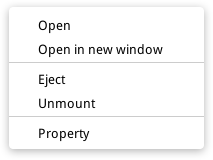

> : User can click on  in the navigation bar to eject the disks.

## Settings|../common/icon_optionsetting.svg|

In Settings, user can create new window, read manual, view information on Deepin File Manager and Exit the application.

In Deepin File Manager interface, click on  to enter ** Settings**.

### New Window

In ** Settings**, click on ** New window** to create a new window.

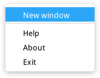

### Help

In ** Settings**, click on ** Help** to view this manual.

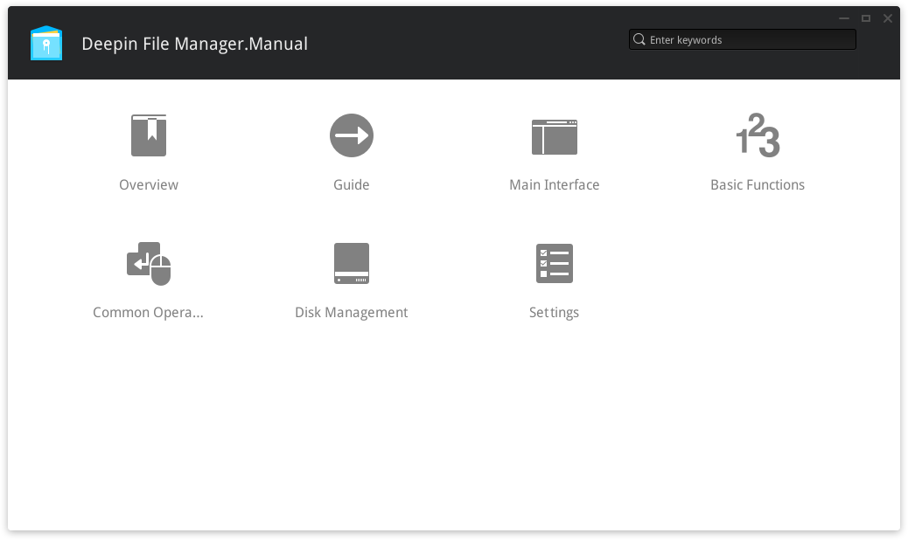

### About

In ** Settings**, click on ** About** to view the version and introduction of Deepin File Manager.

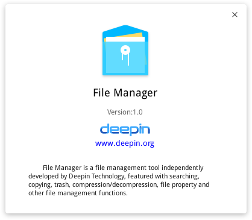

### Exit

In ** Settings**, click on ** Exit** to exit Deepin File Manager.
